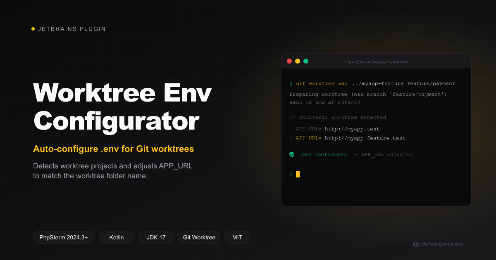
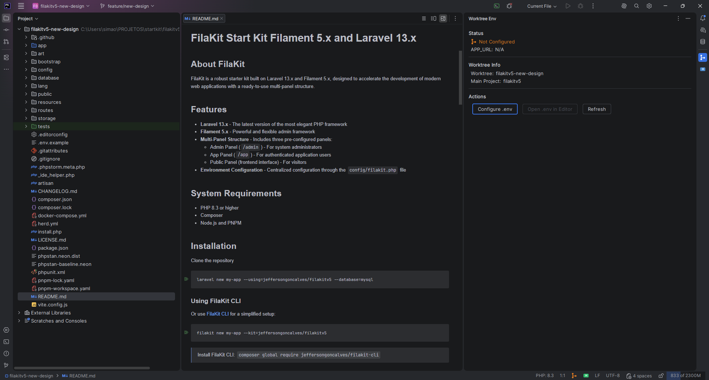
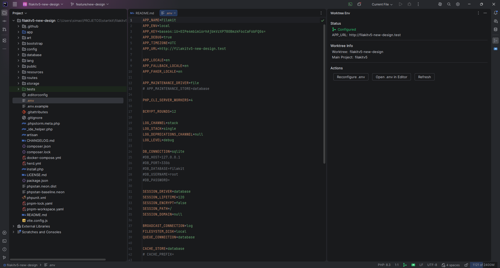

# Worktree Env Configurator



[](https://plugins.jetbrains.com/plugin/31190-worktree-env-configurator)
[](https://plugins.jetbrains.com/plugin/31190-worktree-env-configurator)

> Auto-configure `.env` files for Git worktree projects in PhpStorm.

**Worktree Env Configurator** is a JetBrains plugin that detects when a Laravel project is opened as a [Git worktree](https://git-scm.com/docs/git-worktree) and automatically configures the `.env` file by copying it from the main project and adjusting `APP_URL` to match the worktree folder name.

- **Homepage**: [GitHub](https://github.com/jeffersongoncalves/worktree-env-plugin)
- **Marketplace**: [JetBrains Marketplace](https://plugins.jetbrains.com/plugin/31190-worktree-env-configurator)
- **Issues**: [GitHub Issues](https://github.com/jeffersongoncalves/worktree-env-plugin/issues)

## Screenshots

| Not Configured | Configured |
|:-:|:-:|
|  |  |

## The Problem

When using Git worktrees with Laravel projects, each worktree lives in a separate folder (e.g., `myapp-feature-payment`) and needs its own `.env` with `APP_URL` pointing to the correct local hostname. With Laravel Herd or Valet, this means `http://myapp-feature-payment.test`.

Today this is manual: copy `.env`, edit `APP_URL`. This plugin automates it.

## Features

- **Auto-detection** — Detects Git worktree projects on open via `.git` file parsing
- **Smart APP_URL** — Preserves scheme, compound TLDs, port, and path from the original URL
- **Status bar widget** — Color-coded icon showing worktree `.env` status at a glance
- **Tool window panel** — Full status and actions in the right sidebar
- **Live updates** — UI reacts to `.env` file changes in real time
- **Configurable pattern** — Use `{folder}` placeholder for custom URL patterns
- **`.env.testing` support** — Optionally copies and configures the testing env
- **Smart notifications** — Balloon with "Configure" and "Ignore" actions on project open
- **Lowercase URLs** — All generated `APP_URL` values are lowercased for consistent hostname resolution

## Requirements

- **IDE**: PhpStorm 2024.3+ (or any IntelliJ-based IDE with PHP plugin, builds 243–263.*)
- **Plugins**: Git4Idea (bundled), PHP (bundled in PhpStorm)
- **Java**: JDK 17+

## Installation

### From JetBrains Marketplace

1. Open PhpStorm → **Settings** → **Plugins** → **Marketplace**
2. Search for **"Worktree Env Configurator"**
3. Click **Install** and restart the IDE

Or install directly from: [Worktree Env Configurator on JetBrains Marketplace](https://plugins.jetbrains.com/plugin/31190-worktree-env-configurator)

### From Disk

1. Download the latest release `.zip` from [Releases](https://github.com/jeffersongoncalves/worktree-env-plugin/releases)
2. Open PhpStorm → **Settings** → **Plugins** → **⚙️** → **Install Plugin from Disk...**
3. Select the `.zip` file and restart the IDE

## Usage

### Quick Start

1. Open a Git worktree project in PhpStorm
2. The plugin detects the worktree and shows a notification
3. Click **Configure .env** — the `.env` is copied and `APP_URL` is adjusted
4. Status bar turns green when configured

### Tool Window

Access via **View → Tool Windows → Worktree Env** or click the worktree icon in the right sidebar.

| Section | Description |
|---------|-------------|
| **Status** | Shows configured/unconfigured state with color-coded icon and current `APP_URL` |
| **Worktree Info** | Displays worktree folder name and main project name |
| **Actions** | Configure .env, Open .env in editor, Refresh status |

### Status Bar

The status bar widget (bottom-right) shows:
- **Green icon** — `.env` is configured with correct `APP_URL` (hover for URL)
- **Orange icon** — Worktree detected but `.env` not yet configured (click to open tool window)

### Actions Menu

Available under **Tools → Configure Worktree .env** (only visible in worktree projects).

### APP_URL Resolution

The plugin intelligently replaces only the hostname while preserving everything else:

| Main Project `.env` | Worktree Folder | Generated `APP_URL` |
|---|---|---|
| `http://myapp.test` | `myapp-feature` | `http://myapp-feature.test` |
| `https://myapp.herd.local` | `myapp-feature` | `https://myapp-feature.herd.local` |
| `http://myapp.dev.br:8080/api` | `myapp-feature` | `http://myapp-feature.dev.br:8080/api` |

Or use a custom pattern in settings: `http://{folder}.test`

## Settings

**Settings → Tools → Worktree Env Configurator**

| Setting | Default | Description |
|---|---|---|
| Auto-configure on open | `true` | Show notification when a worktree is detected |
| Copy `.env.testing` | `true` | Also configure `.env.testing` if it exists in the main project |
| Open in editor | `true` | Open `.env` in the editor after configuration |
| Pattern | _(empty)_ | Custom URL pattern using `{folder}` placeholder. Empty = auto-detect from main `.env` |

### Ignored Projects

When you click "Ignore this project" on the notification, the project is added to an ignore list. Reset via **Settings → Tools → Worktree Env Configurator → Reset Ignored Projects**.

## How It Works

1. On project open, reads the `.git` file (not directory) — this indicates a worktree
2. Parses the `gitdir:` path and resolves the main project via `commondir`
3. Checks if `.env` exists in the worktree with the correct `APP_URL`
4. If not configured, shows a balloon notification with actions
5. On configure: copies `.env` from main project, replaces only the `APP_URL` line
6. File system listener watches for `.env` changes and updates UI in real time

## Building from Source

```bash
# Clone the repository
git clone git@github.com:jeffersongoncalves/worktree-env-plugin.git
cd worktree-env-plugin

# Build the plugin
./gradlew buildPlugin

# Run PhpStorm sandbox with plugin loaded
./gradlew runIde

# Run tests
./gradlew test

# Verify plugin compatibility
./gradlew verifyPlugin
```

The built plugin archive will be in `build/distributions/`.

## License

[MIT](LICENSE)

## Author

**Jefferson Gonçalves** — [GitHub](https://github.com/jeffersongoncalves)
